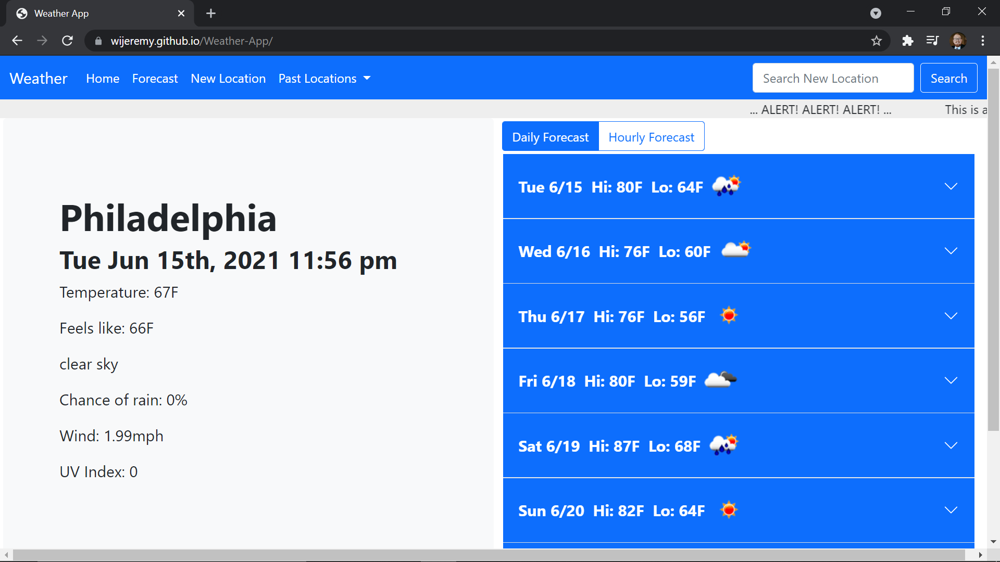

# Weather-App

https://wijeremy.github.io/Weather-App/

 

This was a very deep project. There were many parts that I pushed myself on, and I'm not sure how well it turned out. Ultimately I am very happy with how it looks and runs on a computer. I tried to make the most of the information that was afforded me by the api. Putting up a ticker that feeds alert information and having the option to view the forecast either daily or hourly were easy enough touches to spur my confidence on to keep pushing myself. Eventually I made copies of the city.list.json file that was availabe in the documentation and then a copy of the country codes that was also linked in the documentation. I was worried that there would be ambiguous results from a simple search. I didn't see a way to search by city and zip in the documentation (I might have missed it, but honestly, I kind of just wanted to try to implement this next idea regardless of the need). And so I created a pop up field that would return every country and every city in that country. It is probably not the most elegant solution from a UX perspective; the amount of data available is enormous. But I had the idea and I had to try it, and I'm honestly rather happy with the results. Except for when we get on mobile. For one, the modal that I used for the city disambiguator just doesnt work on mobile iOS Safari. To boot, it runs very slowly on mobile. So was it a success? I think so. I'm proud of it, but I know there is room for improvement.